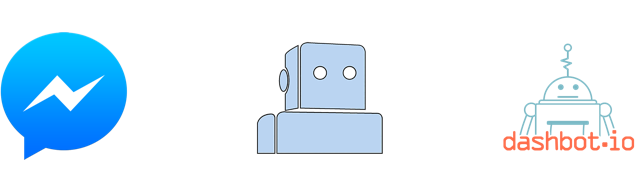

<div align="center">


<h1>
  [Messenger Bot Boilerplate](https://www.facebook.com/messengerbotboilerplate/)
</h1>
<div>
  [](https://david-dm.org/hoodsy/messenger-bot-boilerplate)
  [](https://david-dm.org/hoodsy/messenger-bot-boilerplate#info=devDependencies)
</div>

A **Chatbot boilerplate** app for **[Facebook Messenger](https://www.messenger.com)** with **NLP** by **[Wit.ai](https://wit.ai)** and **analytics** by **[Dashbot.io](https://www.dashbot.io/)**.

Also includes a basic send/receive API and message templates.


</div>

# Table of Contents
- [Usage](#usage)
- [Setup](#setup)
	- [Facebook Messenger](#facebook-messenger)
	- [Wit.ai](#witai)
	- [Dashbot](#dashbot)
- [Deploy](#deploy)


# Usage
```
git clone https://github.com/hoodsy/messenger-bot-boilerplate.git
cd messenger-bot-boilerplate
npm install
npm start
```

# Setup
### Facebook Messenger
1. Follow the steps at **[Messenger Bot Tutorial](https://github.com/jw84/messenger-bot-tutorial#setup-the-facebook-app)** to create a Facebook App or Page, setup Webhooks, and set Environmental Variables.

2. Set ```FB_PAGE_TOKEN```, ```FB_APP_SECRET``` and ```FB_VERIFY_TOKEN``` in ```example.env```.

3. Move ```example.env``` -> ```.env```.


### Wit.ai
1. Sign up for a [Wit.ai account here](https://wit.ai).

2. Clone [messenger-bot-boilerplate on Wit.ai](https://wit.ai/hoodsy/messenger-bot-boilerplate).

3. Set ```WIT_TOKEN``` with your *Server Access Token* from Wit.ai.

4. Check out **[Messenger Bot Wit.ai Tutorial](https://github.com/jw84/messenger-bot-witai-tutorial#setup-witai)** to learn how and why we want to use Wit.ai for NLP in our bot.


### Dashbot
1. Sign up for a [Dashbot account here](https://www.dashbot.io/).

2. Create a new app in Dashbot.

3. Set ```DASHBOT_KEY``` with your *Bot Key* from Wit.ai.

# Deploy
*TODO: serverless deploy with [AWS Lambda](https://aws.amazon.com/lambda/)*

Head back to **[Messenger Bot Tutorial](https://github.com/jw84/messenger-bot-tutorial)** for a walkthrough on deploying your bot.
